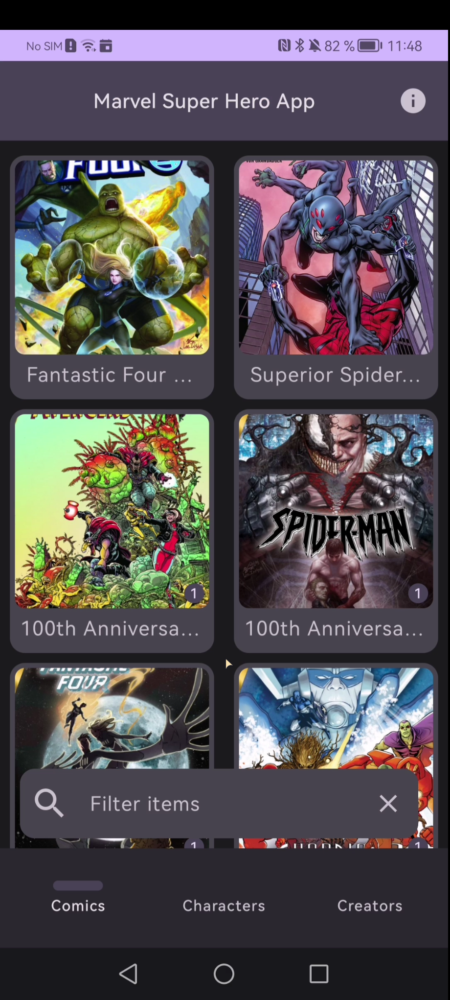

# Super Hero App Coding Challenge

Quick example app showing the usage of various compose, network and storage related libraries. The focus was on using
these libraries. Not much focus was put on cleaning up the code or handling errors in a more than basic way.

The app uses the [Super Hero API](https://superheroapi.com/) to fetch superhero data.

## Notes

To show usage of SqlDelight and Ktor, the comic data is handled via these libraries. Characters and creators are handled
via Retrofit and Room.

To get started quickly, I used my decades old bx libraries. Updated over time, but still quite aged. **Please ignore the
bx packages entirely.**

## Libraries

- [Coil](https://coil-kt.github.io/coil/)
- [Compose](https://developer.android.com/jetpack/compose)
- [Koin](https://insert-koin.io/)
- [Kotlin Coroutines](https://developer.android.com/kotlin/coroutines)
- [Kotlin Flow](https://kotlinlang.org/docs/flow.html)
- [Ktor](https://ktor.io/)
- [Material3](https://m3.material.io/)
- [Navigation](https://developer.android.com/guide/navigation)
- [OkHttp](https://square.github.io/okhttp/)
- [Paging3](https://developer.android.com/jetpack/androidx/releases/paging)
- [Palette](https://developer.android.com/training/material/palette-colors)
- [Retrofit](https://square.github.io/retrofit/)
- [Room](https://developer.android.com/jetpack/androidx/releases/room)
- [SqlDelight](https://cashapp.github.io/sqldelight/)

## Screenshots

| Comics                                  | Detail                                  | Character                                  |
|-----------------------------------------|-----------------------------------------|--------------------------------------------|
|  |  |  |
